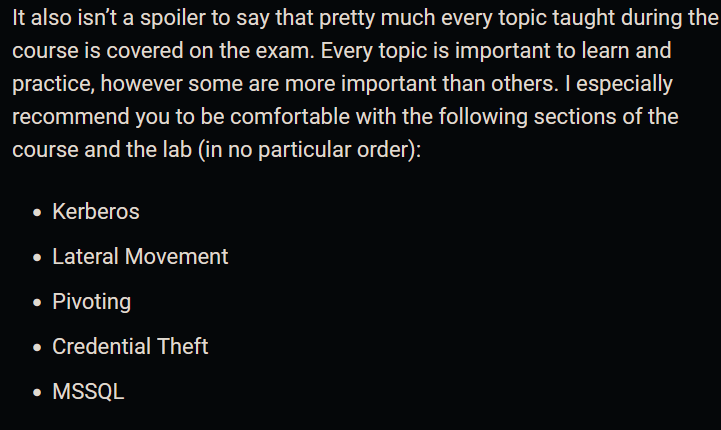
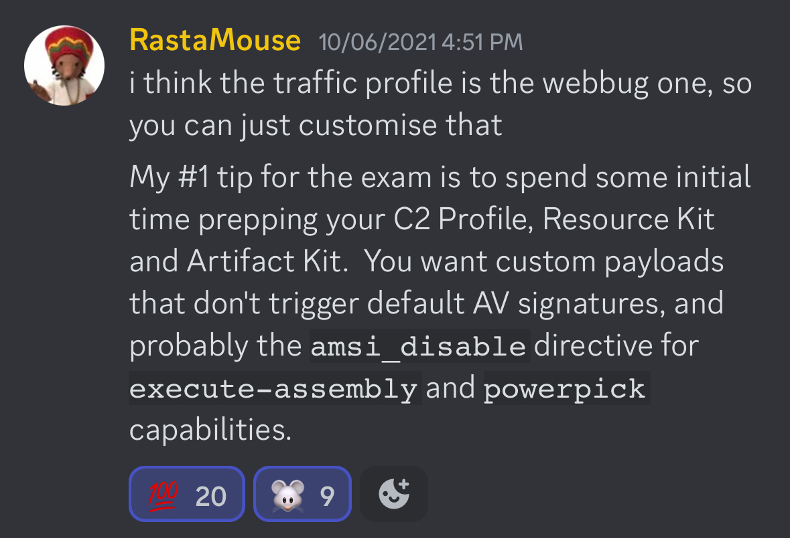
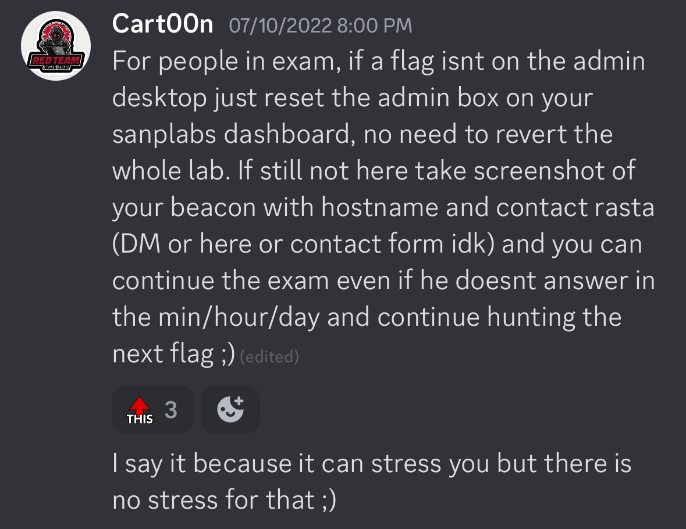
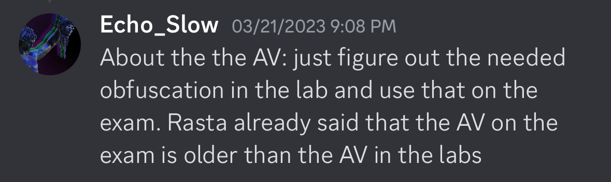

# Exam Guide/Tips - Points

- [ ]  Check official exam guide : [https://training.zeropointsecurity.co.uk/pages/red-team-ops-exam](https://training.zeropointsecurity.co.uk/pages/red-team-ops-exam)
- [ ]  Check out the Cobalt Strike Training Material - [https://www.cobaltstrike.com/training/](https://www.cobaltstrike.com/training/) or [https://youtube.com/playlist?list=PLcjpg2ik7YT6H5l9Jx-1ooRYpfvznAInJ](https://youtube.com/playlist?list=PLcjpg2ik7YT6H5l9Jx-1ooRYpfvznAInJ)
- [ ]  Check out the GOAD Lab Environment - [https://github.com/Orange-Cyberdefense/GOAD](https://github.com/Orange-Cyberdefense/GOAD)
- [ ]  Use Guacamole Instance on Edge Browser.
- [ ]  If you Wants to use Firefox , Enable Firefox Async Clipboard - [https://sudoedit.com/firefox-async-clipboard/](https://sudoedit.com/firefox-async-clipboard/)
- [ ]  For Persistence on machines
    - Dump Local Admin Credentials (Passwords and Hash) , then Perform PTH, OPTH and Use Make_token to get shell.
    - Add a Windows Service for Persistence with SYSTEM Access by Dropping a binary to disk.
    - Add a SMB Beacon to Scheduled Tasks, Registry , or StartupFolder for Autorun.
    - Add a DNS Beacon to Scheduled Tasks, Registry , or StartupFolder for Autorun.
    - Use this Aggressor Script to make life easy - [https://github.com/Peco602/cobaltstrike-aggressor-scripts/tree/main/persistence-sharpersist](https://github.com/Peco602/cobaltstrike-aggressor-scripts/tree/main/persistence-sharpersist)

- [ ]  There is no password/hash cracking in exam, So attacks such as Kerberoasting, ASRepRoasting and Domain Cached Credentials probably won’t be in exam environment, but they are present in Lab Env.
- [ ]  Make Sure to Atleast once Solve complete Lab with AV and APPLocker enabled.
- [ ]  Do not skip the extra mile challenge in lab (Applocker and Outbound Forest).
- [ ]  Make sure to enable AV and Force Windows Defender GPO to all the Computers and Across all domain and Forests and if not works manually enable Windows Defender on each and Every Machine.
- [ ]  If your beacon is not calling back home , then check below few things
    - [ ]  If powershell execute cradle or binary reverse shell is not working then,
        - Check if host can connect back to the teamserver
        - Check if the target powershell is not running in Contrained Language Mode.
        - Check for Applocker if enabled or not, if enabled then probably use a Binary or jump with psexec (Coz it uploads the binary to c:\Windows folder)
        - Also for Applocker, if we are not able to get the beacon , Then try using LOLBAS to execute the beacon code.

### Tips from CRTO Review Blogs

- Troubleshooting CRTO issues : [https://tripla.dk/2021/01/31/crto-troubleshooting-notes-updates-in-progress/](https://tripla.dk/2021/01/31/crto-troubleshooting-notes-updates-in-progress/)
- By [NoSecurity](https://nosecurity.blog/crto1)
    
    
    
    
    

### Tips from Twitter and Discord

- By @RastaMouse and others on discord
    
    
    
    
    
    
    
    
    
- By @0x1uke on [discord](https://discord.com/channels/866726468989354004/866727478062743572/1087742972596080750).
    
    ```
    As far as general tips go: 
    
    1. I’d recommend copy/pasting a cheat sheet containing the various commands or other information you’re likely  to copy into the environment into your attack machine when you start so that you can copy/paste from that sheet and not have to worry about copy/pasting into the VM too much throughout the exam. The copy/paste with Guacamole can be hit or miss. 
    
    If copying into your VM isn’t working, I found an earlier message on the Discord that helped too:
    	1. copying something to your clipboard in the VM
    	2. Copy the desired text into your clipboard from your host machine
    	3. Paste the text from your host machine into the VM
    That helped get copy/paste working again.
    
    2. Keep things as simple and as close to the course as possible, e.g. use what’s recommended in the course of the c2 profile, the course has the techniques you need to succeed, etc.  
    
    3. You may also find the following blog post useful at some point which has been shared previously in this Discord: https://rastamouse.me/getdomain-vs-getcomputerdomain-vs-getcurrentdomain/
    
    4. If the tool isn’t on the attack station, you don’t need it for the exam. This tip has been shared several times, but it’s helpful to keep in mind.
    
    5. Try your best to enjoy the exam in the midst of the pressure of completing it. It’s challenging, but I found it to be a very rewarding experience beyond just getting the cert.
    ```
    
- By [@InfoSecJohnDoe](https://twitter.com/InfoSecJohnDoe/status/1692978211083141607?s=20) on twitter.
    
    
